# 🌐 Spectrum Atlas - Wireless Signal Spectrum Mapping System

    

## 📖 Project Overview

Spectrum Atlas is a comprehensive wireless signal spectrum mapping and visualization system that integrates hardware and software technologies to generate 2D and 3D heatmaps of wireless signals in spatial environments, providing professional solutions for spectrum analysis, signal monitoring, and visualization applications.

<div align="center">


**Figure 1: Spectrum Atlas System Overview**

</div>

### 🎥 Official Demo Video
<div align="center">

[](https://youtu.be/9fO_MTytgyk)

</div>

## ✨ Core Features

- 🎯 **Multi-band Signal Scanning**: Supports automatic scanning of multiple frequency bands from 27MHz to 1800MHz
- 📍 **Spatial Positioning**: Each sampling point contains precise 2D coordinate information
- 💾 **Data Persistence**: PostgreSQL database storage with multi-session management support
- 🗺️ **Heatmap Generation**: RBF interpolation + Gaussian filtering + visualization rendering
- 🔄 **Batch Processing**: Full frequency band batch output supporting multiple signal types
- 🌐 **Cross-device Collaboration**: Raspberry Pi generation → Local download viewing
- 🖥️ **Interactive Web Interface**: Real-time heatmap visualization with hover information display
- 📊 **Dynamic Data Loading**: Real-time database integration for live data access

## 🏗️ System Architecture

### Hardware Platform
- **Raspberry Pi 4B**: Main control device responsible for running ROS, signal scanning, data storage, and image rendering
- **RTL-SDR USB Receiver**: For acquiring signal strength (RSSI) at different frequency bands
- **LiDAR (LD19)**: For 2D plane mapping construction
- **Positioning Module**: Coordinates with LiDAR to obtain spatial location of each sampling point

<div align="center">


**Figure 2: System Architecture Structure**

</div>

### Software Architecture
- **ROS (Robot Operating System)**: Robot operating system for hardware control and data management
- **Qt GUI**: C++ desktop application providing user interaction interface
- **Flask Web Server**: Python web framework providing backend API services
- **PostgreSQL**: Relational database for signal data storage
- **LiDAR SLAM**: Uses Hector SLAM for environmental map construction

## 🔧 Technical Features

### Supported Signal Types
- **RC Low Band** (27-28 MHz): Toy remote control low frequency band
- **RC Aircraft** (35-36 MHz): UK RC aircraft dedicated frequency band
- **RC Ground** (40-41 MHz): UK RC car/boat remote control frequency band
- **TETRA / Emergency** (380-400 MHz): Police/fire/emergency communications
- **LoRa / ISM 433** (433-434 MHz): LoRa, RF remotes, access control
- **ISM 868** (868-870 MHz): LoRaWAN, Sigfox, NB-IoT, metering
- **GSM 900 UL** (880-915 MHz): User uplink channels (mobile device → base station)
- **GSM 900 DL** (925-960 MHz): Downlink channels (base station → mobile device)
- **FM Radio** (88-108 MHz): FM broadcast
- **Airband (AM)** (118-137 MHz): Pilot communications (AM)
- **AIS / Marine** (161-163 MHz): Maritime automatic identification system
- **ADS-B 1090** (1090 MHz): Aircraft broadcast position
- **LTE 1800** (1710-1760 MHz): LTE user uplink

### Algorithm Flow

#### Algorithm 1: Map Construction and Data Acquisition
<div align="center">


**Figure 3: FPRGH heaptmap generation flowchart and example**

</div>

#### Algorithm 2: Heatmap Generation and Visualization
<div align="center">


**Figure 4: ARH-SS heaptmap generation flowchart and example**

</div>

## 📁 Project Structure

```
CASA0022_Spectrum_Atlas/
├── 3D Models/                    # 3D printed model files
├── Detector/                     # Detector related code
│   ├── ble_scan.py              # BLE signal scanning
│   ├── ldlidar_ros_ws/         # LiDAR ROS workspace
│   └── ros_catkin_ws/          # ROS Catkin workspace
├── Spectrum_Atlas_GUI/          # Qt GUI application
├── Server and Database/         # Server and database
│   ├── Database/               # Database scripts and API
│   └── Flask Server/           # Flask web server
├── Wireless Signal Dataset/     # Wireless signal dataset
└── Images/                     # Project images and charts
```

## 🚀 Quick Start

### Requirements
- **Operating System**: Ubuntu 18.04+ / Raspberry Pi OS
- **Python**: 3.8+
- **ROS**: Melodic (recommended)
- **Qt**: 5.12+
- **Database**: PostgreSQL 12+

### Installation Steps

1. **Clone the Project**
```bash
git clone https://github.com/SiruiLuo/CASA0022_Spectrum_Atlas.git
cd CASA0022_Spectrum_Atlas
```

2. **Install ROS Dependencies**
```bash
# Install ROS Melodic
sudo apt update
sudo apt install ros-melodic-desktop-full

# Initialize ROS workspace
cd Detector/ros_catkin_ws
catkin_make
source devel/setup.bash
```

3. **Install Python Dependencies**
```bash
cd Server and Database/Flask Server/Spectrum_Atlas_Webpage-main
python -m venv spectrum_env
source spectrum_env/bin/activate  # Linux/Mac
# or
spectrum_env\Scripts\activate     # Windows

pip install -r requirements.txt
```

4. **Configure Database**
```bash
# Install PostgreSQL
sudo apt install postgresql postgresql-contrib

# Create database and user
sudo -u postgres psql
CREATE DATABASE spectrum_atlas;
CREATE USER spectrum_user WITH PASSWORD 'your_password';
GRANT ALL PRIVILEGES ON DATABASE spectrum_atlas TO spectrum_user;
\q
```

5. **Compile Qt Application**
```bash
cd Spectrum_Atlas_GUI
qmake
make
```

## 📊 Usage Examples

### Signal Acquisition
The system can automatically scan multiple frequency bands and generate heatmaps:

#### Room01 Signal Heatmaps (2025-07-09)
All frequency band heatmaps generated from room01 data collection:

**Low Frequency Bands:**
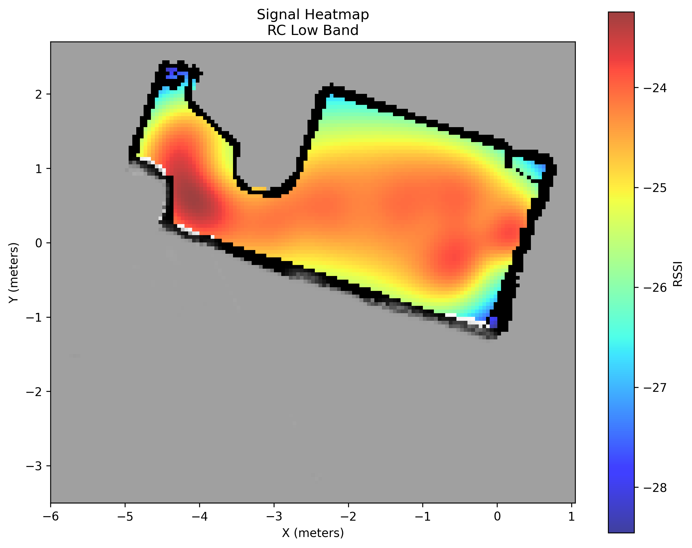 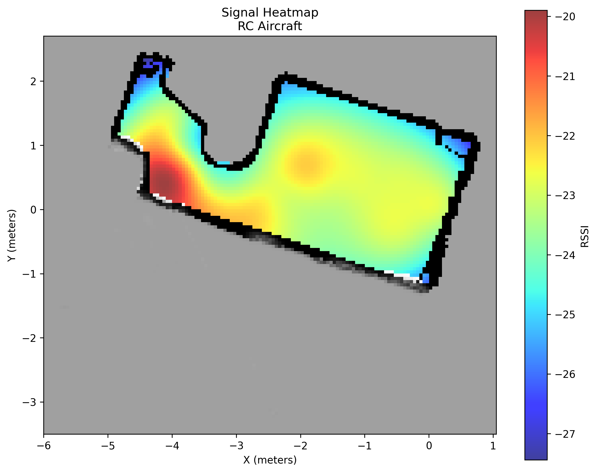 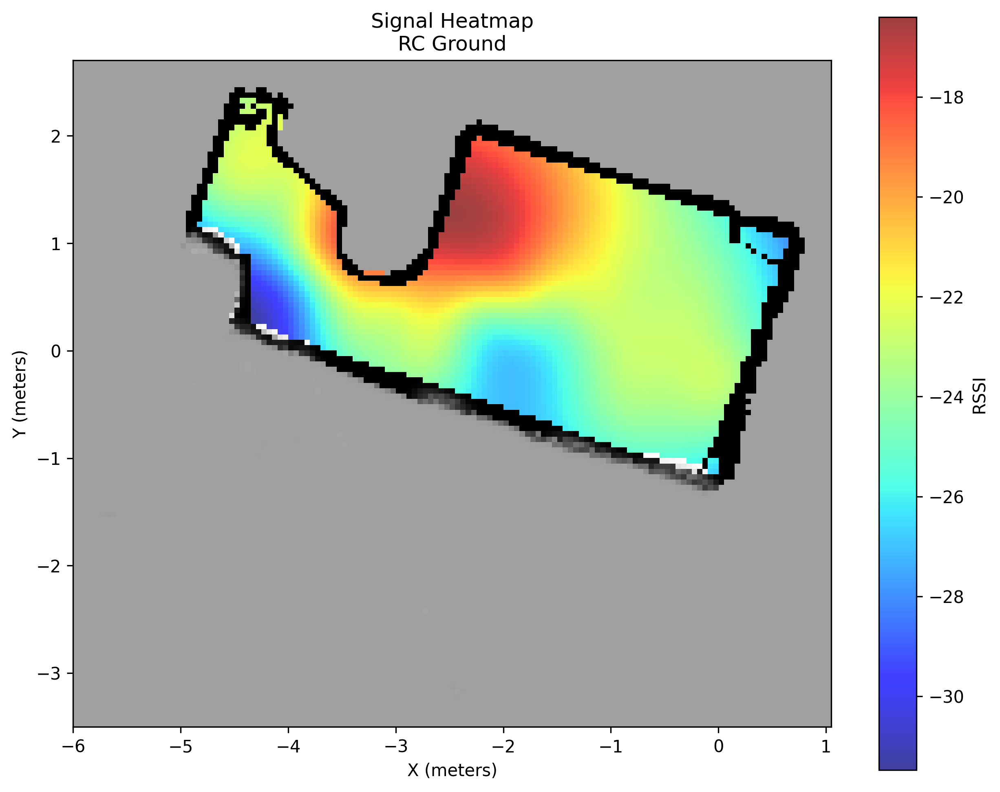

**Medium Frequency Bands:**
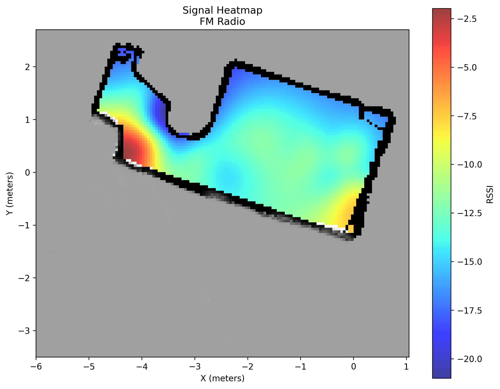 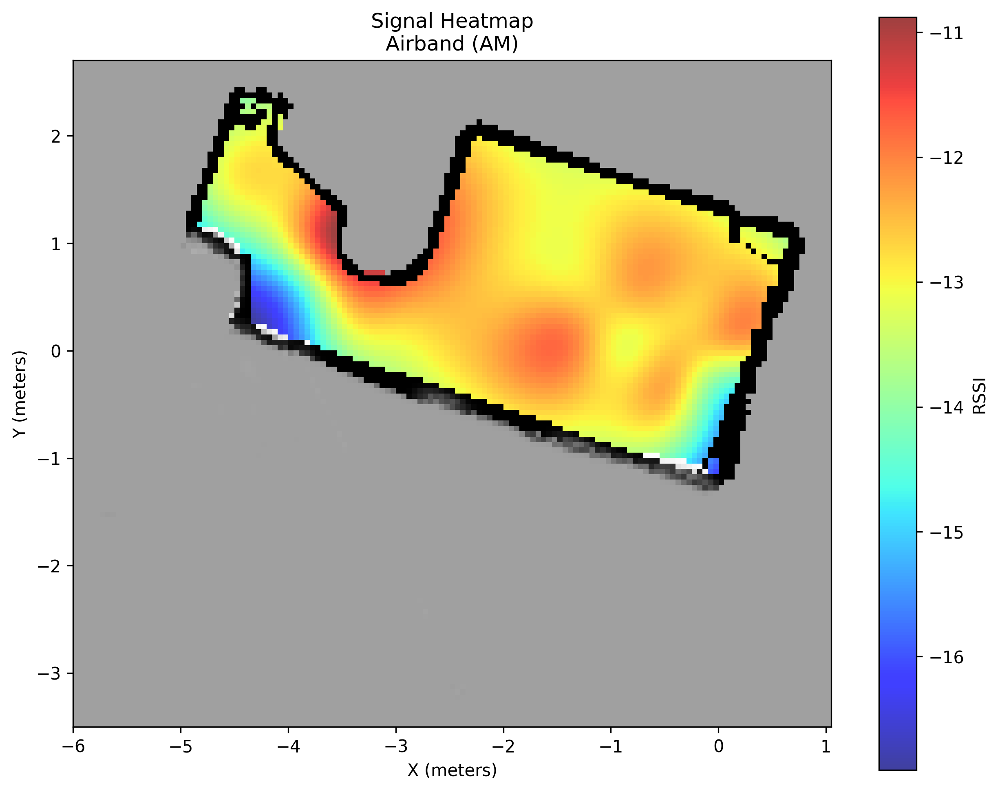 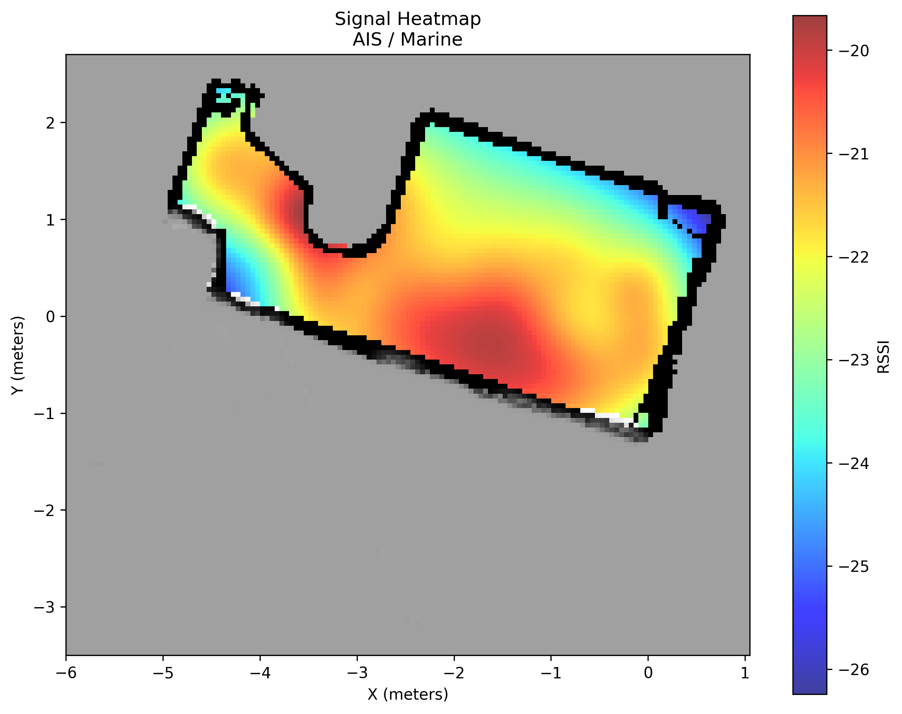

**High Frequency Bands:**
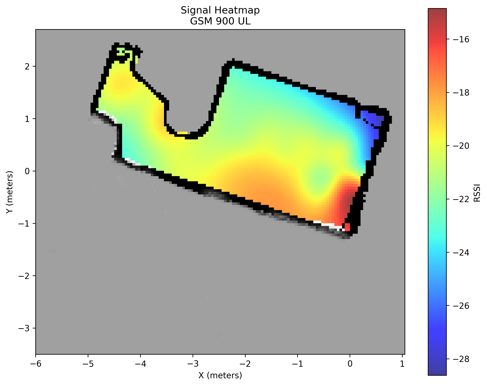 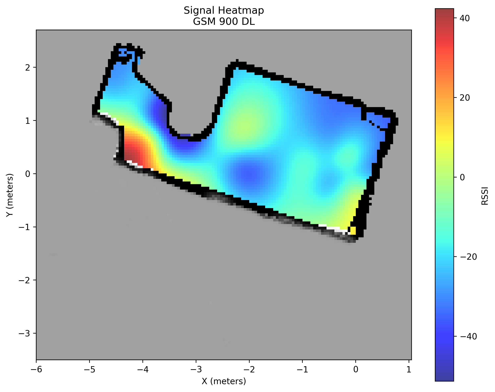 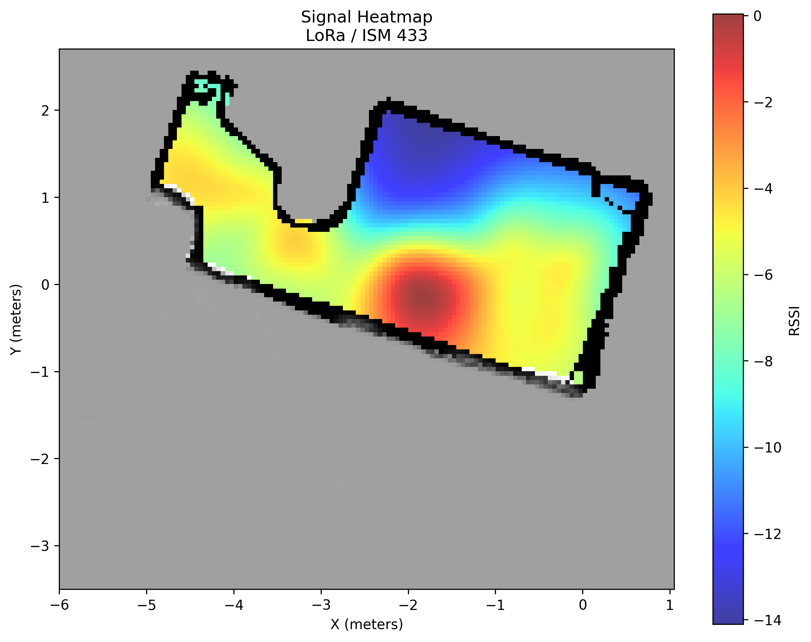

**Ultra High Frequency Bands:**
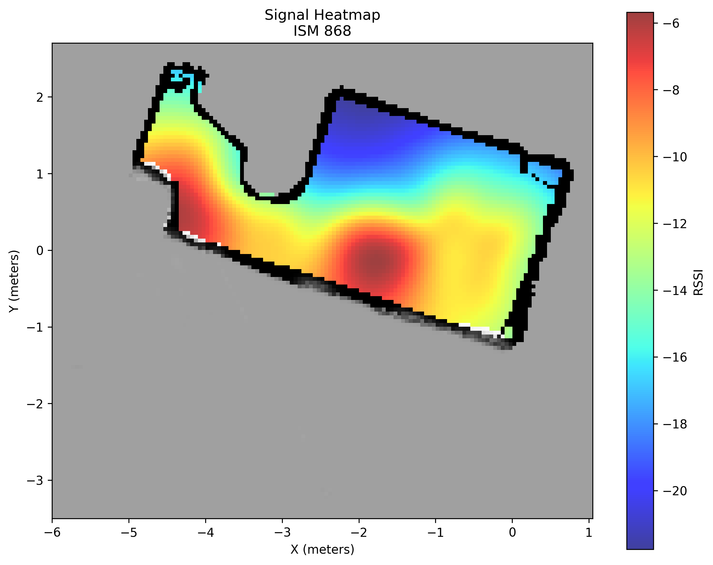 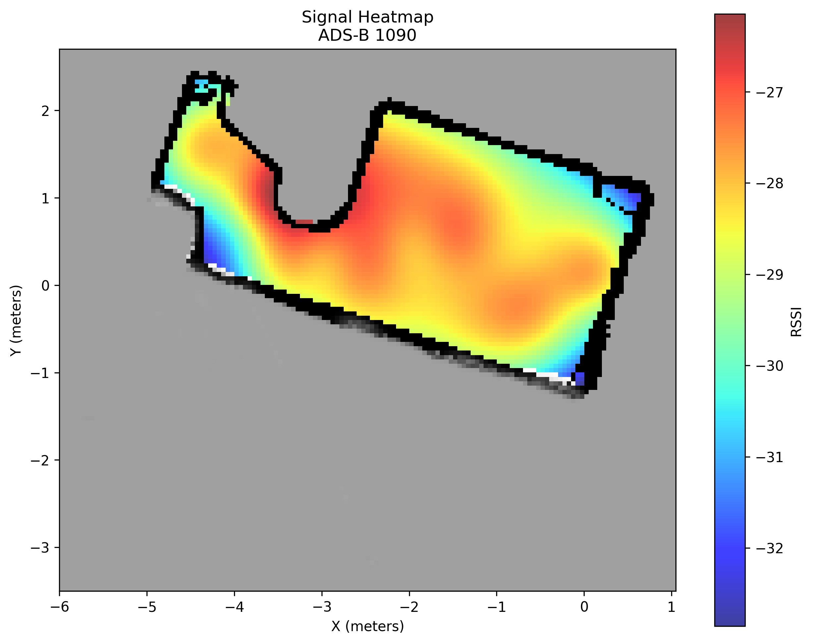 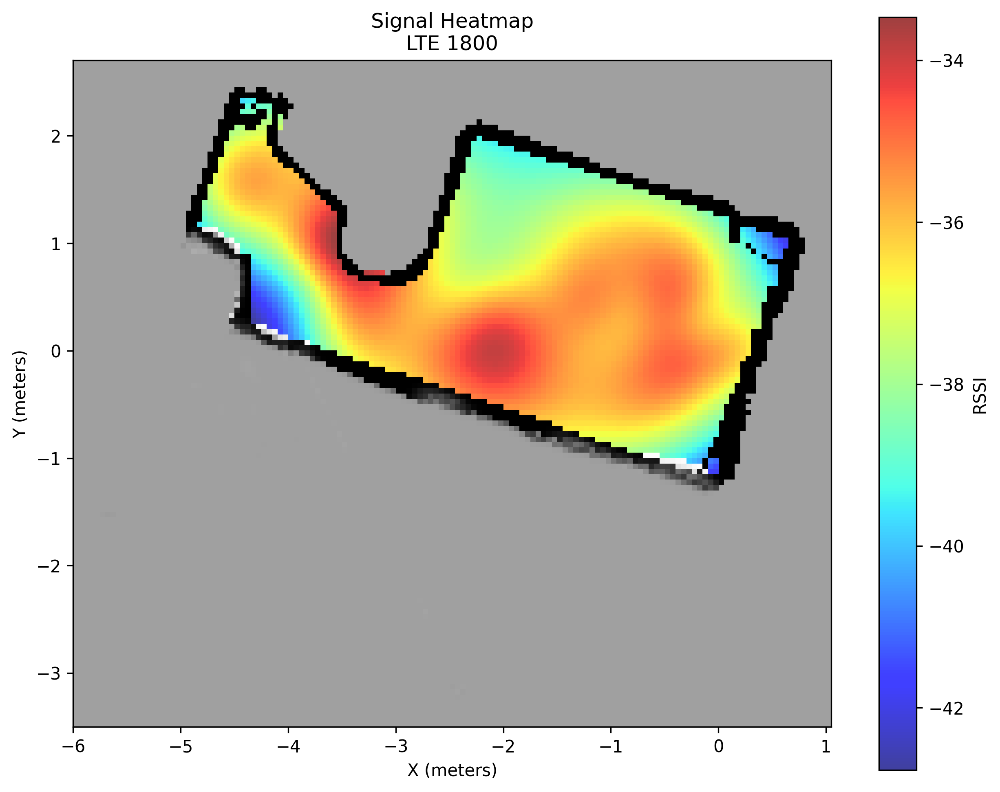

**Emergency & Special Bands:**
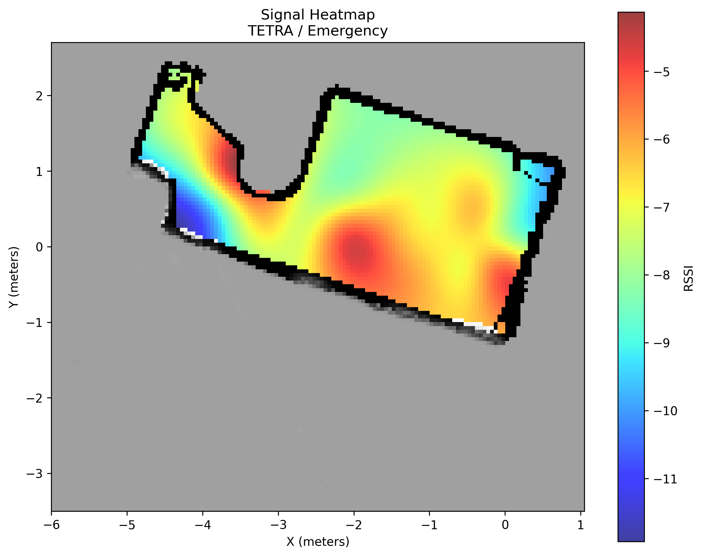

### GUI Interface
<div align="center">


**Figure 5: GUI Interface and Map Display**

</div>

### System Deployment
<div align="center">


**Figure 6: System Deployment in Exhibition**

</div>

## 🔍 Data Acquisition Process

### Sampling Flowchart
<div align="center">


**Figure 7: Data Sampling Flowchart**

</div>

### Data Acquisition Commands and Data
<div align="center">


**Figure 8: Data Acquisition Commands and Data**

</div>

## 🗺️ Map Generation

### Hector SLAM
Uses LiDAR for environmental map construction:

<div align="center">


**Figure 9: Hector SLAM Mapping**

</div>

### Rviz Example
<div align="center">


**Figure 10: Rviz Visualization Example**

</div>

## 💻 Web Application Features

### Interactive Heatmap Visualization
- **Real-time Data Loading**: Connects to PostgreSQL database for live signal data
- **Interactive Controls**: Dynamically select signal types and sessions
- **Hover Information**: Display signal strength and position coordinates on mouse hover
- **Responsive Design**: Optimized for desktop and mobile devices
- **Professional UI**: Modern, clean interface with consistent styling

### Flask Loading Interface
<div align="center">


**Figure 11: Flask Web Application Loading Interface**

</div>

## 🔧 Hardware Components

### Main Components
- **RTL-SDR Receiver**: For signal reception and analysis
- **LiDAR Sensor**: For environmental map construction
- **Antenna System**: For signal reception
- **Display Module**: Waveshare display screen
- **Cooling System**: Fan and heat sink

### 3D Printed Enclosure
The project includes complete 3D printed enclosure design:

#### Main Box
<div align="center">


**Figure 12: 3D Printed Main Box**

</div>

#### Lid Cover
<div align="center">


**Figure 13: 3D Printed Lid Cover**

</div>

#### Handle Components
<div align="center">


**Figure 14: 3D Printed Handle Components**

</div>

## 📈 Performance Metrics

- **Scanning Frequency**: Supports full frequency band scanning from 27MHz to 1800MHz
- **Positioning Accuracy**: Centimeter-level positioning accuracy based on LiDAR
- **Data Update Rate**: Real-time data acquisition and visualization
- **Storage Capacity**: Supports TB-level data storage
- **Concurrent Users**: Web interface supports multiple users accessing simultaneously


## 📞 Contact

- **Project Maintainer**: [Sirui Luo]
- **Email**: [sirui.luo.24@ucl.ac.uk]

## 🙏 Acknowledgments

Thanks to the following open source projects and communities for their support:
- [ROS (Robot Operating System)](https://www.ros.org/)
- [RTL-SDR](https://www.rtl-sdr.com/)
- [Qt Framework](https://www.qt.io/)
- [Flask](https://flask.palletsprojects.com/)
- [PostgreSQL](https://www.postgresql.org/)

---

⭐ If this project is helpful to you, please give me a star! 
